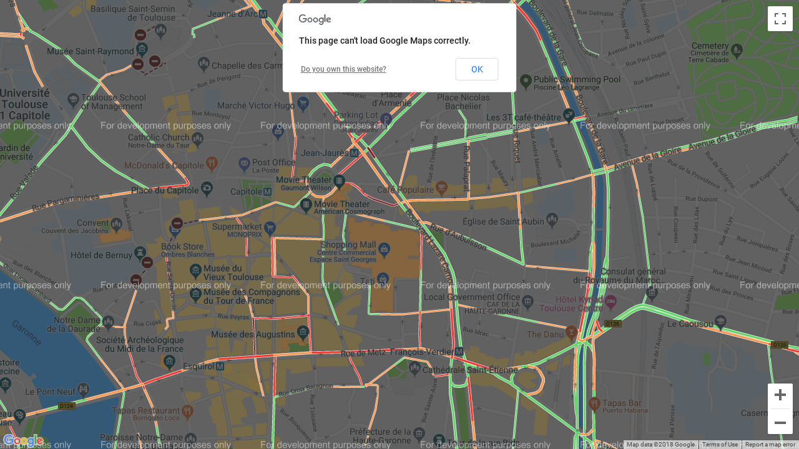

FAQ
===

Why so much requirements?
-------------------------
I've searched a lot for an easy way to get visual traffic informations, the only way I've found is to take a screenshot of Google Maps.

At the moment, to take a screenshot of a web page from a program you need:

* a browser that can run in headless
* a webdriver to pilot the browser

The screenshot displays "This page can't load Google Maps correctly."
---------------------------------------------------------------------

| Google applies rate limiting on API requests, if you have an intensive use of traffic-info you need to get a Google Maps Javascript API key.
| Refer to `Google Maps Platform documentation <https://developers.google.com/maps/documentation/javascript/get-api-key>`_.
