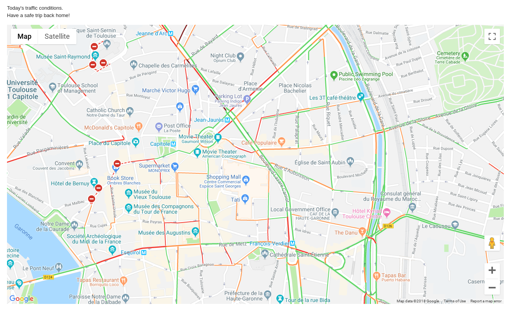

.. Traffic Info documentation master file, created by
   sphinx-quickstart on Tue Jul 24 17:33:02 2018.

Welcome to Traffic Info's documentation!
========================================

.. mdinclude:: ../README.md
   :start-line: 2
   :end-line: 5

.. mdinclude:: ../README.md
   :start-line: 8
   :end-line: 16

User's manual
-------------

* `Requirements <userguide.html#Requirements>`_
* `Installation <userguide.html#Installation>`_
* `Usage <userguide.html#Usage>`_

Developer's reference
----------------------

traffic_info is developed as a Python package, to use it in your code chek :ref:`the reference page <developer>`.

.. toctree::
   :hidden:

   Home <self>
   User's guide <userguide>
   FAQ <faq>
   Developer's manual <developer>
   Changelog <changelog>
